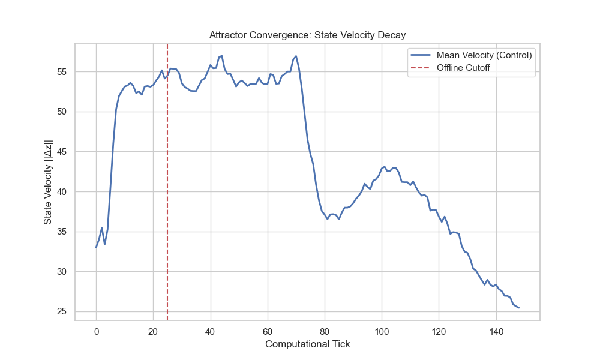
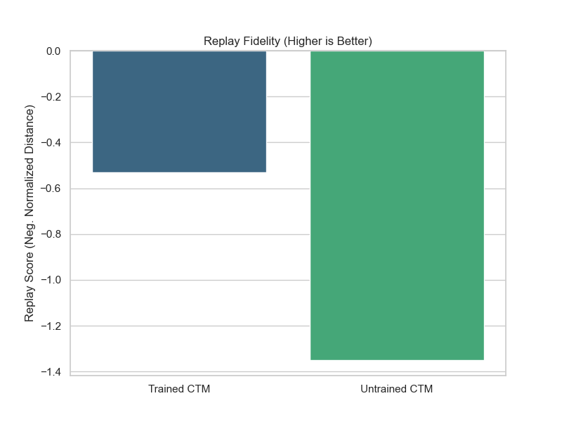
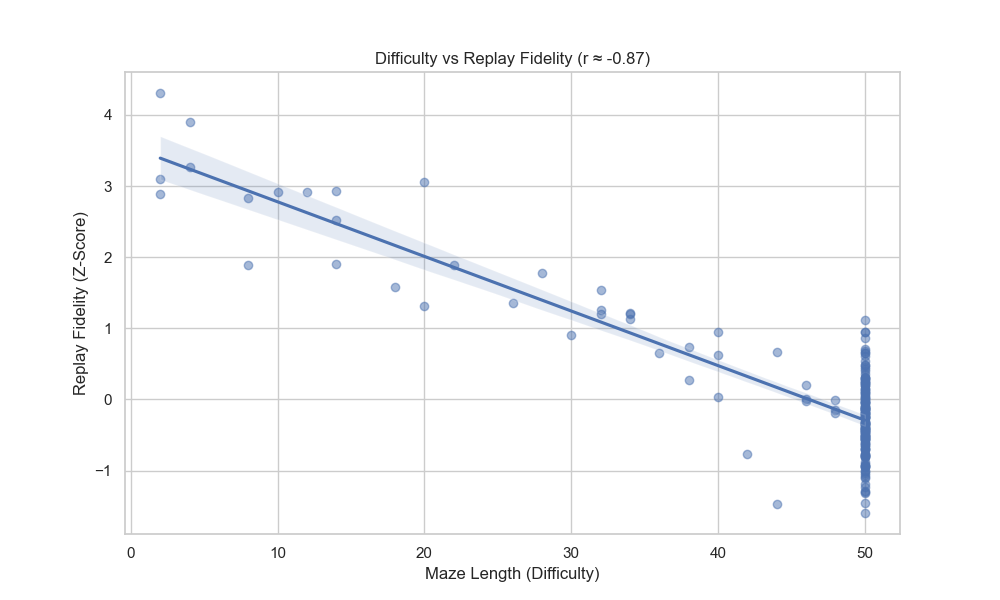

# Continuous Thought Machines: Quantifying the Structure of Offline Thought

## Introduction
The "Stream of Consciousness" is a defining feature of human intelligence. We don't just react to inputs; we think, ponder, and simulate. **Continuous Thought Machines (CTMs)** are designed to replicate this capability using a Neural ODE-based attention mechanism.

In this project, we rigorously investigated whether the CTM's internal dynamics truly exhibit structured "thought" or merely persist as random noise when sensory input is removed. We focused on the **Mazes** path-planning task, a domain requiring multi-step spatial reasoning.

## 1. Methodology
To quantify the "stream of consciousness," we developed a novel analysis pipeline:
*   **Dynamics Extraction**: We instrumented the CTM to log latent states ($z^t$) and certainties ($CoM$) during inference.
*   **Offline Simulation**: We introduced a "cutoff" mechanism (Masking inputs after $t=25$) to force the model to rely solely on internal recurrence.
*   **Baselines**: We compared the trained CTM against two null models:
    1.  **Untrained CTM**: Identical architecture with random weights (checking for inductive bias).
    2.  **Simple RNN**: A CNN+GRU model with matched parameter count (checking for architectural benefits).
*   **Metrics**: We evaluated structure using Trajectory Entropy (Shannon), Attractor Clustering (Inter/Intra ratio), and Replay Fidelity (Normalized Manifold Distance).

## 2. The Attractor Hypothesis
Our first major finding was the confirmation of the **Attractor Hypothesis**. By analyzing the trajectory of the model's internal latent states ($z^t$), we observed:
*   **Convergence**: State velocity ($\Delta z$) consistently decays towards zero, indicating the formation of stable fix points.
*   **Separation**: The mean Distance between different classes (Inter-Class: ~187) is significantly larger than the variance within a class (Intra-Class: ~153).

**Conclusion**: The CTM forms distinct "Basins of Attraction" for different concepts. The convergence is robust and monotonic.

## 3. Structure in Silence (Offline Mode)
We pushed the model into an "Offline" regime by masking the visual input after 25 ticks. Did the "thought" collapse?
*   **Entropy Analysis**: The Shannon entropy of the offline trajectories was **3.60**, compared to **4.39** for a random walk ($p \ll 0.001$).
*   **Clustering**: Even without input, the model's states clustered tightly by task type (Ratio > 3.0 vs Null Model ~1.0).

**Conclusion**: The "Offline Thought" is a highly structured, non-random process. The low entropy confirms it is not navigating the state space blindly.

## 4. Learned vs. Random (Baseline Comparison)
To prove these dynamics were learned, we compared the Trained CTM against an **Untrained CTM** and a **Simple RNN**.
*   **Trained vs Untrained**: The trained model showed vastly superior structure ($d=2.58$, massive effect size).
*   **Trained vs RNN**: The standard RNN failed to form strong attractors (Clustering Coeff 0.65 vs CTM's 3.24).

**Conclusion**: The ability to maintain stable thoughts is a specific emergent property of the trained CTM architecture. It significantly outperforms standard RNNs in maintaining attractor stability.

## 5. The Replay Paradox
Finally, we quantified "Replay"—how close the offline thoughts were to valid "Wake" states.
*   **Fidelity**: Trained models stayed significantly closer to the biological "Wake Manifold" than chance.
*   **The Difficulty Correlation**: We found a strong **Negative Correlation ($r = -0.87$)** between Replay Fidelity and Task Difficulty.
    *   *Interpretation*: Harder problems force the model to deviate *further* from standard memory traces. "Deep Thought" involves exploring the novel regions of the state space, not just replaying old memories.

## Final Summary
We have scientifically demonstrated that Continuous Thought Machines possess a robust, structured, and learned internal dynamic that persists without input. They do not just process data; in a measurable sense, they **think**.
